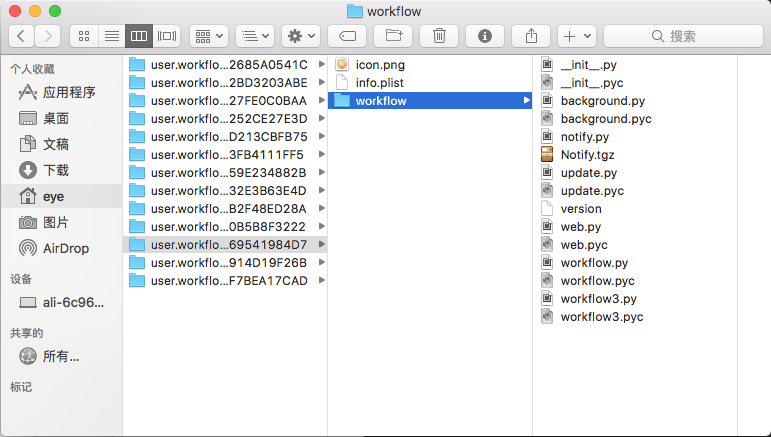

# Alfred Workflow入門教學

## Alfred 之 workflow 入門_JavaDog - jishuwen(技術文)

> [Alfred 之 workflow 入門](https://www.jishuwen.com/d/2qoT/zh-tw)

## 前言

小帽子 alfred 可以說是 macOS 上最佳的效率軟體了，而其中最強大的功能就屬 alfred 2.0 推出的 Workflow 特性了。就像我們工程師遇到重複性工作總是想寫指令碼或者程式來解放自己一樣，workflow 功能允許你將日常重複性的工作通過使用指令碼語言（bash、zsh、php、ruby、python、perl、as、js）封裝起來，通過 alfred 作為統一入口進行使用。

因為 alfred 的受眾之廣，所以寫 workflow 被設計的門檻非常低，低到了官方都沒有寫文字教程，只在 alfred 內嵌了幾個 demo 給使用者自己學習。本文將使用一個示例來詳細說明 workflow 的開發流程。

### 使用者介面

安裝好 alfred 以後，使用預設快捷鍵 option + space 開啟 alfred 入口：


Command + , 開啟設定頁面：


開啟 workflow 選項卡：


點選左下角 + 號，可以新建 workflow 或者檢視一些官方的模板以及上面提到的官方的 demo 示例。


好了，基本操作介面就介紹那麼多，下面就開始我們的 workflow 之旅吧！

### 準備工作

由於 workflow 功能是付費的，所以需要提前購買。具體型別、金額可以參考官網購買地址：[官網購買地址](https://www.jishuwen.com/jump/aHR0cHM6Ly9saW5rLmp1ZWppbi5pbT90YXJnZXQ9aHR0cHMlM0ElMkYlMkZ3d3cuYWxmcmVkYXBwLmNvbSUyRnBvd2VycGFjayUyRmJ1eSUyRg==)。開發語言我們選擇的是 python2.7，一個是語言簡單，另外個是 python 有很多現成的 workflow 的庫，這些庫幫助我們遮蔽了和 alfred 的互動，讓我們專注業務資料的開發，例如：，[github.com/deanishe/al…](https://www.jishuwen.com/jump/aHR0cHM6Ly9saW5rLmp1ZWppbi5pbT90YXJnZXQ9aHR0cHMlM0ElMkYlMkZnaXRodWIuY29tJTJGZGVhbmlzaGUlMkZhbGZyZWQtd29ya2Zsb3clMkY=)。範例裡我們即使用這個庫來進行開發。

### 開發流程

##### 基礎概念

在開發之前我們需要理解 workflow 的幾個基本概念

* Triggers
* Inputs
* Actions
* Outputs

###### Triggers

Triggers 是觸發器，不是必須內容，一般繫結某個快捷鍵來觸發指定的 workflow。

###### Inputs

inputs 是我們使用 workflow 的核心，inputs 主要是控制你在 alfred 視窗輸入快捷鍵和關鍵字以後展示的內容，以最常用的有道翻譯為例：


可以看出 inputs 就是我們需要重點開發的東西，因為 Inputs 可以使關鍵字通過指令碼轉化為許多列的結果展示給我們，而這個正是我們需要的。實際上 workflow 展示出的結果在指令碼中的表現形式就是一個 xml 檔案，示例如下：


對應的 xml：

```
<?xml version="1.0"?>
<items>
    <item uid="1" arg="引數1" valid="yes">
        <title>這個是個title</title>
        <subtitle>這個是個subtitle</subtitle>
        <icon>icon.png</icon>
    </item>
    <item uid="2" arg="引數2" valid="yes">
        <title>這個是個title222</title>
        <subtitle>這個是個subtitle222</subtitle>
        <icon>icon.png</icon>
    </item>
</items>
複製程式碼

```

可以看到每行展示的內容被定義為一個 item，每個 item 有一個 uid，arg 。uid 是每個 item 的唯一編號，不常用。arg 指的是當在這個 item 上觸發事件的時候（例如點選 enter），傳遞給下一個指令碼或者說 Actions 指令碼的入參。

**實際上我們編寫 workflow 的核心就是為了生成這個 xml**

###### Actions

actions 對應選中項（item）選中點選以後的操作，例如根據選項開啟一個網頁等。

###### Outputs

Outputs 一般用於顯示操作的結果，提示操作成功與否，以 Post Notification（提示操作狀態）、Copy to Clipboard（copy 到剪下板）較為常見。

還是以有道翻譯為例，以上四個概念如圖：


看圖可以總結出 workflow 的基本工作方式：

需要注意的是，

從圖上可以看到整個工作流程中，最初的輸入是使用者輸入的關鍵字，但是隨著流轉上一個指令碼的輸出是下一個指令碼的輸入

。

好了到此我們 workflow 的基本概念就介紹完畢，現在讓我們直接進入 workflow 的開發工作吧。

### 指令碼開發

個人總結出來的一個 workflow 的開發流程如下：

1. 明確需求
2. 畫思路圖（熟練以後，直接和步驟 3 合併）
3. 寫指令碼，除錯

下面我們就根據以上三個步驟來示範一個 workflow 的開發。

##### 明確需求

例如我想開發一個豆瓣搜尋圖書的 workflow，當我輸入書名字的時候，可以在展示出所有關聯的書的列表，然後每條記錄展示書的名稱，書的作者以及出版年份。我們在腦子裡腦補了一下，大概做出來的效果如下：


##### 畫思路圖


##### 寫指令碼

因為我們使用的 python 的第三方庫，而這個第三方庫其實作者已經寫了非常詳細的使用方法以及附了 2 個範例，可以看原文：[www.deanishe.net/alfred-work…](https://www.jishuwen.com/jump/aHR0cHM6Ly9saW5rLmp1ZWppbi5pbT90YXJnZXQ9aHR0cCUzQSUyRiUyRnd3dy5kZWFuaXNoZS5uZXQlMkZhbGZyZWQtd29ya2Zsb3clMkZ0dXRvcmlhbC5odG1s)（強烈建議有餘力的同學讀原版教程），這裡我就簡單的結合我們的需求加工（翻譯) 下：

###### 1、建立一個 workflow

首先，建立一個新的，空白的 workflow，如圖：


###### 2、簡單描述下你的 workflow

點選 Blank Workflow 以後會跳出 workflow 的基本配置視窗，圖如下，需要注意的是 bundle Id 的填寫，該欄位需要在你所有的 workflow 理保持唯一（類的全路徑名）。可以將一個圖片拖動到 workflow 上來改變 workflow 的外觀，填寫完畢點選 create 即可儲存。


###### 3、新增 Script Filter

雙擊新建立的 workflow，在空白處右鍵建立一個 Script Filter，通過上面的基礎概念說明我們可以瞭解，Script Filter 是 Inputs 的一種，而 Inputs 的作用是接收使用者輸入（可選），然後根據使用者輸入通過指令碼過濾展示資料。


在建立 Script Filter 的時候，我們需要填寫一些基本資訊，如圖。keyword 表示該 workflow 的觸發的快捷鍵，參考基礎概念圖中的 yd 和 test。因為我們搜尋豆瓣圖書的時候是需要輸入書名字的，所以選擇 Argument Required，這個其實就是強制要求必須輸入引數才會執行指令碼，當然有的 workflow 也是不需要入參的。


###### 4、編寫除錯你的 python 指令碼

建立完 Script Filter 以後在 workflow 上右鍵，open in finder，開啟 workflow 的本地資料夾：


開啟以後一個空白的 workflow 應該是如下的：


可以看到只有一個圖示和一個 info.plist, 可以開啟 info.plist 檢視，裡面是該 workflow 的所有配置資訊，這裡就不說了。

為了正常使用該 python 的第三方庫，我們需要在 github 上下載該庫：[github.com/deanishe/al…](https://www.jishuwen.com/jump/aHR0cHM6Ly9saW5rLmp1ZWppbi5pbT90YXJnZXQ9aHR0cHMlM0ElMkYlMkZnaXRodWIuY29tJTJGZGVhbmlzaGUlMkZhbGZyZWQtd29ya2Zsb3clMkY=)，並且複製其中的 workflow 資料夾到你本地的 workflow 資料夾，複製好以後你本地的 workflow 資料夾列表應該如下：



同時我們需要在該資料夾下建立我們的主要指令碼檔案，douban.py（在 script filter 中配置的），最終全部建立好以後如下：


最後我們只需要編寫 douban.py 的程式碼即可。ps：比較方便一點的是先在編輯器中建立檔案，然後編輯除錯好程式碼直接複製過去即可。

限於篇幅就不一一說明每行程式碼方式了，如下：

```
import sys

import requests

from workflow import Workflow, ICON_WEB


def get_recent_posts(query):
    
    url = 'https://api.douban.com/v2/book/search'
    
    query_string = dict(q=query)
    headers = {
        'cache-control': "no-cache",
    }
    r = requests.request("GET", url, headers=headers, params=query_string)
    
    r.raise_for_status()
    
    result = r.json()
    
    posts = result['books']
    return posts


def main(wf):
    
    if len(wf.args):
        query = wf.args[0]
    else:
        query = None
    
    posts = get_recent_posts(query)

    
    for post in posts:
        title = post['title'] + "  " + post['author'][0]
        subtitle = post['subtitle'] + "  " + post['publisher'] + "  " + post['pubdate']
        wf.add_item(title=title, subtitle=subtitle, arg=post['alt'], valid=True, icon=ICON_WEB)
    
    wf.send_feedback()


if __name__ == u"__main__":
    
    wf = Workflow()
    
    sys.exit(wf.run(main))

複製程式碼

```

可以看到，使用第三方庫開發 workflow 的流程如下：


其中只有 2，和 3 的封裝過程需要我們編寫程式碼，第三方庫完全遮蔽了我們和 alfred 的互動，可以讓我們更專注在資料的開發上。

以上程式碼編寫完，測試效果如下：


###### 5、新增 workflow 的 actions

我們搜尋了書籍，如果看到感興趣的書，肯定想著說開啟一些書的主頁看下，那麼難道還需要跑到豆瓣上再去開啟？當然是不需要的。所以我們需要一個【選中一個選項直接 enter 或者 shift 開啟這本書對應的豆瓣主頁】的功能，那麼 actions 就是做這個動作的。在 script filter 上右鍵 新增一個 actions：


需要注意的是這裡的 query 並非是使用者一開始輸入的 query，因為觸發這個動作是點選 script filter 中的一個 item 觸發的，所以這裡的 query 指的是【基礎概念】章節介紹的 xml 格式裡面的每個 item 對應的 arg，參照我們 python 的程式碼裡表示的是每本書的主頁的連結地址!

```
wf.add_item(title=title, subtitle=subtitle, arg=post['alt'], valid=True, icon=ICON_WEB)
複製程式碼

```


當然，如果你想更改點選的快捷鍵，可以單擊 script filter 和 actions 的連結：


好了到此為止，我們就大功告成了，這時候點選 alfred 搜尋出來的資料，可以直接使用 chrome 開啟書的主頁了, 當然既然用到了第三方庫，第三方庫還是有很多高階功能的，比如快取，主要目的是放置被 api 伺服器 ban 掉，可以把搜尋的資料快取在本地，具體的 api 可以參考該第三方庫的文件：[www.deanishe.net/alfred-work…](https://www.jishuwen.com/jump/aHR0cHM6Ly9saW5rLmp1ZWppbi5pbT90YXJnZXQ9aHR0cCUzQSUyRiUyRnd3dy5kZWFuaXNoZS5uZXQlMkZhbGZyZWQtd29ya2Zsb3clMkZhcGklMkZpbmRleC5odG1s)。

### 其他

1. 其實我們平時需要些 workflow 的地方很少，更多的用的是配置快捷鍵開啟指定網址的功能，可以讓我們快速的在內網各個系統中來回穿梭。
2. 如果需要寫 workflow 的話也沒必要親自寫。有很多網站維護了很多的常用的 workflow，比如：[alfredworkflow.com/](https://www.jishuwen.com/jump/aHR0cHM6Ly9saW5rLmp1ZWppbi5pbT90YXJnZXQ9aHR0cCUzQSUyRiUyRmFsZnJlZHdvcmtmbG93LmNvbSUyRg==) 裡就有各種常用的。
3. workflow 當然不止文章中表述的功能那麼簡單，還可以開發更復雜更靈活的功能，需要大家自己研究了。
4. workflow 最好的學習方法不是自己琢磨研究，而是拿功能類似的過來改吧改吧，改的次數多了，很快就熟悉了。
5. 示例見附件，下載後雙擊即可匯入。
6. 有收穫，點個讚唄！

### 參考文章

[www.zhihu.com/question/22…](https://www.jishuwen.com/jump/aHR0cHM6Ly9saW5rLmp1ZWppbi5pbT90YXJnZXQ9aHR0cHMlM0ElMkYlMkZ3d3cuemhpaHUuY29tJTJGcXVlc3Rpb24lMkYyMjMwMTM2Mg==)

[alfredworkflow.com/](https://www.jishuwen.com/jump/aHR0cHM6Ly9saW5rLmp1ZWppbi5pbT90YXJnZXQ9aHR0cCUzQSUyRiUyRmFsZnJlZHdvcmtmbG93LmNvbSUyRg==)

[github.com/deanishe/al…](https://www.jishuwen.com/jump/aHR0cHM6Ly9saW5rLmp1ZWppbi5pbT90YXJnZXQ9aHR0cHMlM0ElMkYlMkZnaXRodWIuY29tJTJGZGVhbmlzaGUlMkZhbGZyZWQtd29ya2Zsb3clMkY=)

[www.deanishe.net/alfred-work…](https://www.jishuwen.com/jump/aHR0cHM6Ly9saW5rLmp1ZWppbi5pbT90YXJnZXQ9aHR0cCUzQSUyRiUyRnd3dy5kZWFuaXNoZS5uZXQlMkZhbGZyZWQtd29ya2Zsb3clMkZpbmRleC5odG1s)

[myg0u.com/python/2015…](https://www.jishuwen.com/jump/aHR0cHM6Ly9saW5rLmp1ZWppbi5pbT90YXJnZXQ9aHR0cCUzQSUyRiUyRm15ZzB1LmNvbSUyRnB5dGhvbiUyRjIwMTUlMkYwNSUyRjIzJTJGdHV0b3JpYWwtYWxmcmVkLXdvcmtmbG93Lmh0bWw=)

[computers.tutsplus.com/tutorials/a…](https://www.jishuwen.com/jump/aHR0cHM6Ly9saW5rLmp1ZWppbi5pbT90YXJnZXQ9aHR0cHMlM0ElMkYlMkZjb21wdXRlcnMudHV0c3BsdXMuY29tJTJGdHV0b3JpYWxzJTJGYWxmcmVkLXdvcmtmbG93cy1mb3ItYWR2YW5jZWQtdXNlcnMtLW1hYy02MDk2Mw==)

[developers.douban.com/wiki/?title…](https://www.jishuwen.com/jump/aHR0cHM6Ly9saW5rLmp1ZWppbi5pbT90YXJnZXQ9aHR0cHMlM0ElMkYlMkZkZXZlbG9wZXJzLmRvdWJhbi5jb20lMkZ3aWtpJTJGJTNGdGl0bGUlM0Rib29rX3YyJTIzZ2V0X2Jvb2tfc2VhcmNo)
